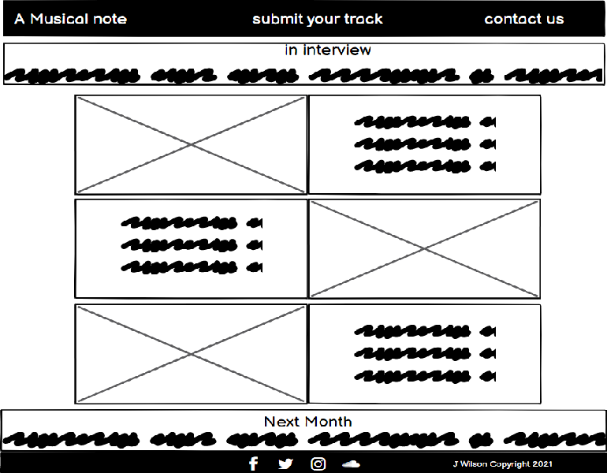

 

Milestone Project One Jamie Wilson

Main Idea:

As a hobbyist music composer/producer I am constantly scrolling through the internet, reading reviews, tips, methods and generally trying to keep abreast of the constantly changing world of music technology. So I thought my project should centre around a site that I myself would be interested in visiting on a regular basis.

The basis of the idea:

A monthly website aimed at musicians young and old, experienced and unskilled, with the aim to educate and inform those 
who have an interest in creating music. Inspired by a website I visit often (MusicRadar.com) I have planned and laid out a 
site which, in theory, would be easily updateable and expandable on a monthly basis so as to keep a relevant stream of 
fresh, interesting and accurate content being delivered to the user. It is with this in mind that I feel, as someone who 
would personally be interested in a site like this, that the finished product will give the user access to relevant, 
interesting news, advice and reviews, and an opportunity to have their own music featured on the site.

Main Page Content:

The page will consist of: 
A main header with logo 
A main banner with a summary of content 
A regular feature "in interview" 
A regular feature "tech news" 
A "this month" feature which would target a different aspect of music technology each month 
and finally a footer contining social links and copyright/ownership information.

Each element will lead the user to an individual page dedicated to that particular task in hand.

General Typography and styling: 
The styling that i have decided to go for is a very clean black and white interface.  I have opted for the Oswald font 
style because after being introduced to it via the learning modules, I have become rather fond of its style and felt it 
fitted in with the look I was hoping to acheive. I decided to go with a style of text where I refrain from using capitals,
I personally like this style but to some I appreciate it can look un-attractive.

Methods used:

Neumorphism using CSS: I was looking for a way to enhance simple text entry boxes on my form pages and I discovered 
that I could give the illusion of raising or sinking the element within the page using simple box-shadowing. This I 
applied throughout the site where I felt it necessary to enhance an element. 
 
On the article pages I wanted to make a simple enhancement to the text areas so I opted to use a gradient option to fade two 
colors into each other. I felt this gave enough interest to the eye without taking away from the text.  
 
The "How To...." page I wanted to feature a very interactive element, blending information with a good visual presentation
and I wanted to feature the use of Modals. So I researched a couple of articles and through W3schools.com, I integrated their 
modal code into the page and adapted it to suit my needs.

Site layout in more detail.

The Landing Page  

 

The landing page will consist of a "fixed" header that will be repeated across all pages with the logo "The Musical note"
along with a clickable "submit your track" option and a clickable "contact us" option. 
Below this will be a summary of four selectable items of interest, clicking on these will take the user to the relevant 
option. 
Below this will feature two of the main monthly features , one being the monthly "in interview" section, and the other
being the monthly round-up of tech news. Again both features are selectable and will take the user to the relevant page. In
the case of the tech news I have opted that the feature will link directly to an established music news website "Music Radar"
where this will keep the user updated on a daily basis as the news can change that often. 
Finally, below this will feature a "next month" section which will have an image and an outline of what is coming next
month. This element is purely for information purposes only and features no interaction. In the "real world scenario"
this feature would then appear within the summary bar next month. 
The page is finished up with a footer featuring links to Facebook, Twitter, Instagram, and Soundcloud. Again in the "real 
world" these would link to the actual "The Musical note" pages but at this point they simply open the relevant social 
media page. In the bottom corner there will be a note of the month and issue number.

The Submit Your Track Page 

 

The "Submit Your Track" page I wanted to keep very plain and straightforward. I have based this decision on other sites
I have visited in the past. The user is there purely to submit their own music for consideration to be featured on the
Spotify page, maybe even be declared "Track of the Month!". Therefore I felt there should be no visual distractions, just
a simple, straightforward form on a clean background. 
The header is there for navigating back to the home page and of course the footer will still hold the social media links. 
Edit** After creating the contact us page based on the same layout I thought the two were too similar so I applied a 
rgb(129, 183, 26) color to the background which is close to the Spotify brand color. This way I hope this is  a very 
simple but effective way of knowing exactly which form page the user is on.

The Contact Us Page 

 

As with the "Submit Your Track" page I wanted distractions kept to a minimum and opted for a clean, simple, black on white 
contact form. This looked effective but perhpas a little bland so with an idea in mind I researched into Neumorphism and 
the ability to implement it into the form using CSS. This I did successfully and I feel it lifts the input boxes out of the
page even though i opted to have the shadows inset. I applied the same effect to the "Submit Your Track" form successfully
and also to the main header, adjusting it accordingly to avoid bleeding into neighbouring elements.

The In Interview Page 

 

Simplicity really is the keyword throughout this site, and the "In Interview" page is no different. I wanted to have the 
page stand out from "the norm" so opted to adopt a purple theme throughout the page. This tied in with the images color
scheme and in the "real world" every months theme would be decided by the images used within the article. To maintain 
an intersting feel about the page I researched and used a "webkit-gradient" appearance on the text boxes to make 
them look a little more appealing. 
I used a basic alternating image / information method to deliver the interview. The interview was sourced from this months 
Computer Music magazine of which I subscribe to, and the additional images were sourced from the internet (source mentioned 
below).  Again the header is present, followed by a short introduction to the article's content.  
At the end of the article there is a banner with a link to the artists material and a link to their own website and a 
mention of what is coming next month. 
Due to the length of the page I have opted to add a homepage icon to the footer so the user doesn't have to scroll back up
to the top of the page to continue their journey.

The Cubase 11 review Page 

 

I styled the "Cubase 11 review" page from the "In Interview" page so as to have an element of continuity throughout the 
site. I kept the "webkit-gradient" effect on the text boxes but changed the color scheme to a grey into white color. 
I decided as an extra element to the page to include a youtube video continuing the information on the new features of the 
software under review. This would run within the page instead of taking the user away from the site. 
Finishing up, in the bottom information banner I included links to similar software that will take the user direct to 
their homepages , and again a "Next Month" line informing the user of what to expect in the next edition along with a link 
to the upcoming software in case the user wanted to check it out there and then. 
Once more, due to the length of the article I included a homepage link in the footer so the user doesn't have to scroll back
 to the top of the page.

The Spotify feature Page 

 

This page is where the user has the potential to have his/hers music featured on the site. There's even an option to obtain
 the "Track of The Month" award. In theory this list could go on indefinitly but i have decided to limit the track count to 
 four. 
 Once again, I used the color scheme to resemble the spotify brand color and alternated each track with the black and the 
 green to add a little contrast and visual interest.  
 Each track plays within it's player and a brief outline of the track sits opposite.  
 Again, due to the length of the article I have the homepage icon in the footer for quick access back to the main page.
  
  
 As mentioned previously, the "tech news" page links direct to the "Music Radar" website so there was no styling to do on 
 this aspect, simply set up the link.

Source of images used: 
 Next Big Hit: https://www.digitaldjtips.com/2018/11/how-dance-music-is-made-today-part-1-the-rise-of-the-bedroom-producer/ 
 Audio Interfaces : https://www.nytimes.com/wirecutter/reviews/best-usb-audio-interface/  
 Sophia Loizou : https://blog.bimm.co.uk/sophia-loizou-women-in-music  
 Tech News: https://www.musicradar.com/news/the-best-daws-the-best-music-production-software-for-pc-and-mac 
 Spotify Logo: https://martechtoday.com/spotify-launches-self-serve-platform-audio-ad-campaigns-204594 
Image used for the contact us/submit your track: https://www.windmilllanerecording.com/wp-content/uploads/2016/11/blog-article-image.png 

Sources of guidance, information, and general help: 
Code Institute: www.codeinstitute.net 
Stack Overflow: www.stackoverflow.com 
W3Schools: www.w3schools.com 
